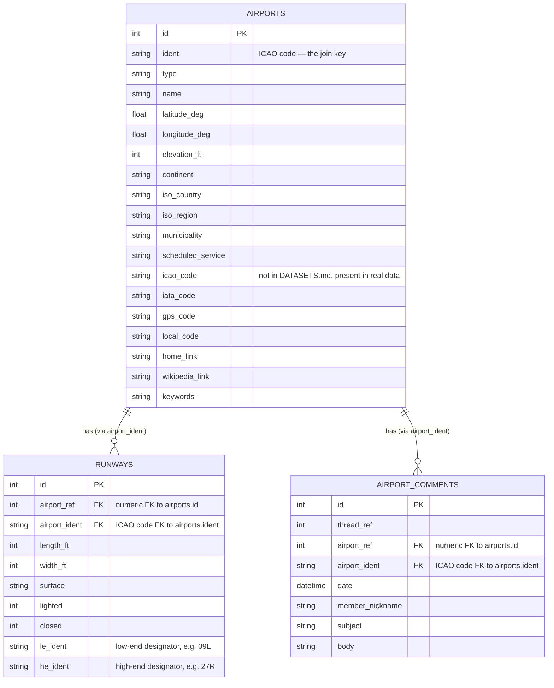
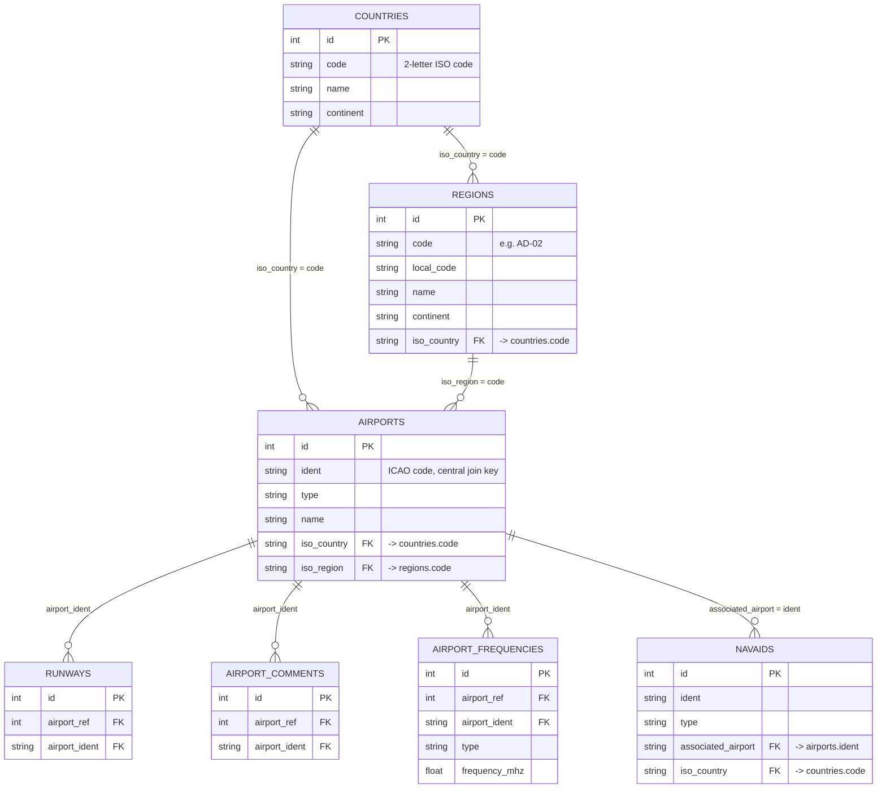

# AirStats — Entity-Relationship Diagram

**Scope: 3 tables only.** `ourairports-data/` (the vendored open dataset) has 7
CSVs total, but this project's assignment (`README.md` Part 4) explicitly
scopes the raw layer to exactly 3: `airports`, `runways`, `airport_comments`.
`airport-frequencies.csv`, `countries.csv`, `navaids.csv`, and `regions.csv`
sit in the same folder but are out of scope — not loaded, not referenced by
any exercise.

---

## Diagram

*(`runways` also carries 10 more low-end/high-end detail columns —
`le_latitude_deg`, `le_longitude_deg`, `le_elevation_ft`, `le_heading_degT`,
`le_displaced_threshold_ft` and their `he_*` mirrors — omitted above to keep
the diagram readable; full list is in `DATASETS.md` and the raw load script.)*

---

## The relationships, in plain terms

- **One airport → many runways.** An airport typically has 1–4 runways; a
  runway always belongs to exactly one airport.
- **One airport → many comments.** Any number of users can comment on the
  same airport; a comment always refers to exactly one airport.
- **Two parallel join keys exist for both child tables**: a numeric
  `airport_ref` (→ `airports.id`) and a string `airport_ident` (→
  `airports.ident`, the ICAO code). The assignment's own exercises join on
  **`airport_ident`**, not `airport_ref` — worth being consistent about which
  one you use in `relationships` tests later, since both technically work.
- **No relationship between `runways` and `airport_comments` directly** —
  they only relate to each other *through* `airports`.

## Cardinality note worth knowing before writing `relationships` tests

Neither child table is guaranteed to have a matching parent in 100% of real
rows — this is crowd-sourced open data, not a clean synthetic dataset. That's
exactly why the assignment (Part 8) asks for `relationships` tests at
`severity: warn` rather than the default `error`: referential integrity is a
useful signal to watch, not a hard guarantee to enforce here.

---

## Bonus: the *full* OurAirports dataset (7 tables) — not part of this project

You asked whether all tables connect — within this project's 3-table scope,
no. But `ourairports-data/` actually has 7 CSVs, and I checked all their real
headers: **across the full dataset, every table does connect, transitively,
through `airports` as the central hub.** It's a connected graph, not a fully
connected mesh — most pairs relate only *through* `airports`, not directly to
each other. **None of this is used by the capstone assignment** — shown here
purely for context, since you asked.

**How each connects, verified against the real CSV headers** (not assumed):
- `countries.code` (2-letter ISO) ← referenced by `regions.iso_country`, `airports.iso_country`, and `navaids.iso_country`
- `regions.code` (e.g. `AD-02`) ← referenced by `airports.iso_region`
- `airports.ident` (ICAO code) ← referenced by `runways.airport_ident`, `airport_comments.airport_ident`, `airport-frequencies.airport_ident`, and `navaids.associated_airport` (same join key, different column name)
- `airports.id` (numeric) ← referenced in parallel by `runways.airport_ref`, `airport_comments.airport_ref`, `airport-frequencies.airport_ref`

So the honest full answer: it's **one connected component**, shaped like
`countries → regions → airports → {runways, airport_comments,
airport-frequencies, navaids}` — a hierarchy feeding into a hub, not a web
where every table touches every other one directly.
